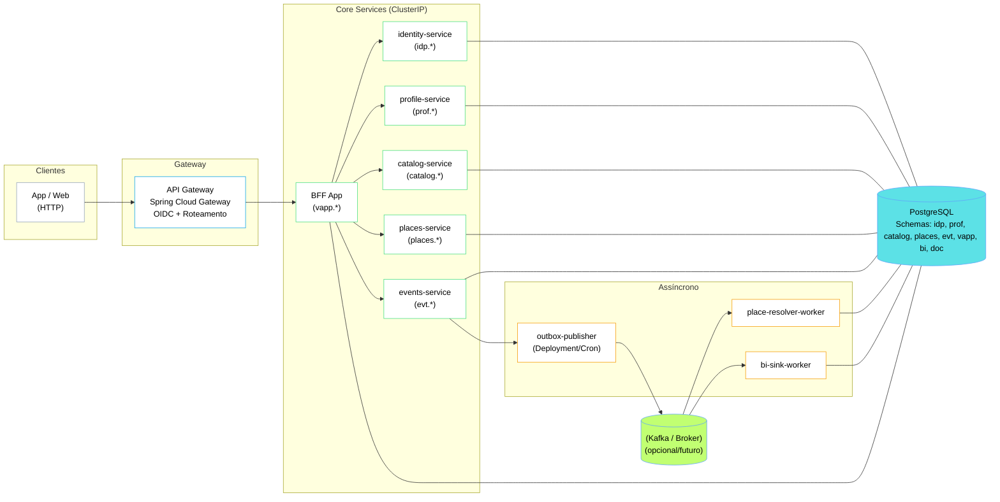

# 🏧 Bar4tix — Arquitetura (Visão Detalhada)

**Stack alvo (evolutiva):**  
Java 21 · Spring Boot 3.5.x (WebFlux/Reactor) · Kafka · Redis · PostgreSQL (PostGIS) · Traefik · Docker/K8s  
**Observabilidade:** Micrometer/OTLP · Prometheus · Grafana · Jaeger · Loki (logs)  
**Cliente:** Mobile/Web · BFF WebFlux · APIs API-first (REST + SSE)  
**Estilo:** Event-Driven + API-first · CQRS light (quando útil) · Multiregião (futuro)

---

## 0) Princípios

- **MVP enxuto**: dividir quando doer (escala/ownership).  
- **Idempotência em toda a borda** (ingestão e gravações).  
- **Schema versionado** (Avro/JSON Schema) e policies de evolução.  
- **Infra observável por padrão** (RED + USE + KPIs de dados).  
- **Privacidade by-design (LGPD)** e **segurança em camadas**.

---

## 1) Macro-serviços (bounded contexts)

### 1.1 ingestion-service
Responsável pela aquisição de **cupom NFC-e (QR)**, **panfletos (crawler+OCR)** e **códigos de barras**.  
Publica eventos Kafka (`ingestion.receipt.v1`, `ingestion.flyer.v1`, `ingestion.scan.v1`).  
Deduplica por `source_id`, calcula confiabilidade (cupom > panfleto > manual).  

### 1.2 catalog-service
Normaliza e deduplica produtos, GTIN/EAN, categorias e marcas.  
Publica `catalog.product-upsert.v1` e `catalog.product-merge.v1`.  
Usa PostgreSQL com índices GIN e atributos JSONB.

### 1.3 pricing-service
Consolida preços por loja x produto, aplica **regras de peso** e **janelas temporais**, detecta anomalias.  
Publica `pricing.price-upsert.v1` e `pricing.anomaly.v1`.  
Mantém `price_observation`, `price_current` e `price_stats_daily`.

### 1.4 comparison-service (BFF)
Expõe rotas `/v1/compare` e `/v1/sse/price-changes`.  
Lê de Redis/Postgres e consome eventos de pricing para manter cache quente.  
TTL de cache: 5–30min, invalidação por `productId`, `storeId`, `regionId`.

### 1.5 places-service
Gerencia check-ins, geofencing e integração com Google Places.  
Publica `place.checkin.v1` e `place.store-upsert.v1`.  
Tabelas com PostGIS e índices geoespaciais.

### 1.6 bi-service
Agrega dados, gera relatórios e exports para B2B (CSV/Parquet).  
Publica `bi.report-ready.v1`.  
Armazena em Postgres + Iceberg (futuro).

### 1.7 identity-service
Gerencia contas, consentimentos LGPD, perfis e papéis.  
Publica `identity.consent-updated.v1`.

### 1.8 gateway (Traefik)
Roteamento, rate-limit, TLS, autenticação JWT/OAuth2 e circuit-breakers por rota.

---

## 2) APIs (exemplos)

### comparison-service (BFF)
- `GET /v1/compare?gtin=...&lat=...&lng=...` — compara preços e distâncias.
- `GET /v1/sse/price-changes` — notifica variações em tempo real.
- `POST /v1/scan` — envia GTIN escaneado; emite `ingestion.scan.v1`.

### ingestion-service
- `POST /v1/receipt` — upload de QR/NFC-e.  
- `POST /v1/flyer` — upload de imagem/URL (OCR assíncrono).  
- `GET /v1/jobs/{id}` — status de processamento.

### bi-service (B2B)
- `POST /v1/reports/price-variation` — gera relatório de variação de preço (CSV).

---

## 3) Kafka e Contratos

**Padrão:** `domain.eventName.v{major}`  
**Exemplo:** `pricing.price-upsert.v1`  
**Particionamento:** por `store_id` ou `product_id|region_id`.  
**Retenção:** ingestion 30-90d, pricing 14-30d.  
**Schema Registry:** compatibilidade `BACKWARD_TRANSITIVE`.  
**Envelope JSON:** inclui `meta`, `key` e `data`.

---

## 4) Banco de Dados (PostgreSQL + PostGIS)

Esquemas principais:
- **catalog:** `product`, `brand`, `category`, `product_attribute(jsonb)`
- **stores:** `store`, `region`, `place(geom)`
- **pricing:** `price_observation`, `price_current`, `price_stats_daily`
- **ingestion:** `ingestion_jobs`, `receipt_raw`, `flyer_raw`, `ocr_result`
- **identity:** `user`, `consent`, `role`, `user_role`

Partitioning mensal e índices GIN/GIST.

---

## 5) Redis (Cache de Leitura)

Chaves:  
- `cmp:gtin:{gtin}:geo:{geohash}` — lista de `{store, price, dist}`.  
- `cmp:store:{storeId}:top:{N}` — top-N por loja.  
TTL 5–30min.  
Warm-up via consumidor Kafka `pricing.price-upsert.v1`.

---

## 6) Segurança e LGPD

- **Gateway:** autenticação JWT/OAuth2 (Keycloak/Cognito).  
- **Scopes:** `cmp:read`, `ing:write`, `bi:read`, `admin:*`.  
- **Anonimização:** hash (salted) de CPFs/emails.  
- **Criptografia:** TLS e TDE/KMS.  
- **Consentimento:** granular por finalidade (`analytics_basic`, `offers_optin`).

---

## 7) Observabilidade

- **Métricas:** HTTP (RED), Kafka lag, Redis hits, acurácia de preço.  
- **Logs:** JSON estruturado (traceId, spanId).  
- **Traces:** Jaeger/OTLP.  
- **SLOs:**  
  - BFF P95 ≤ 250ms (hit) / 800ms (miss).  
  - Freshness de preço ≤ 60s.  
  - Disponibilidade 99.9%.

---

## 8) Deploy e Ambientes

Ambientes: `dev`, `qa`, `prod`.  
K8s + Helm + ArgoCD; HPA; PodDisruptionBudgets; Secrets via Vault.  
Traefik como gateway; storage S3-like para panfletos.  
Jobs OCR e crawler como CronJobs.

---

## 9) Versionamento de Schema

- Compatibilidade `BACKWARD_TRANSITIVE`.  
- Dual-publish em versões maiores (`v1` + `v2`).  
- Campos novos sempre com `default`.  
- Nunca alterar chave de particao sem migração.

---

## 10) ADRs Recomendados

- ADR-010 — Estratégia de Monetização.  
- ADR-011 — Política LGPD e Retenção.  
- ADR-012 — Padrão de Eventos e Versionamento.  
- ADR-013 — Consolidação de Preços.  
- ADR-014 — Estratégia de Cache.  
- ADR-015 — Particionamento Kafka e Concorrência.  
- ADR-016 — PostGIS e Geofencing.  
- ADR-017 — Observabilidade Padrão.

---

**Autor:** Vagner Coelho Pinto  
**Data:** 2025-10-14  
**Versão:** 1.0  
**Licença:** CC-BY-NC-SA 4.0

## 🧩 Diagrama

