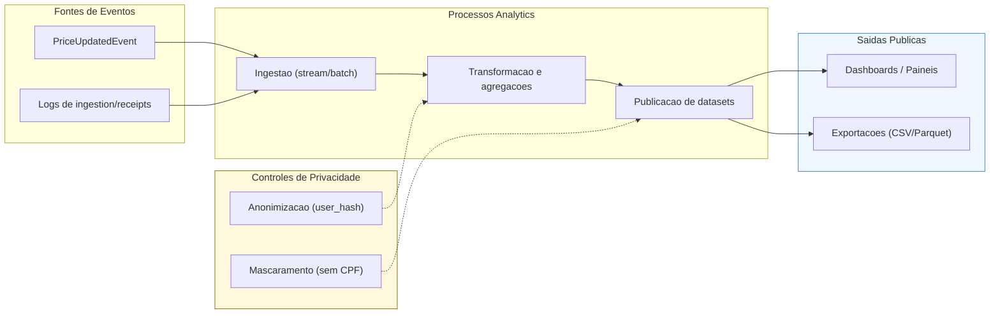

# Fluxo — Domínio Analytics

> **Objetivo:** produzir métricas públicas agregadas e relatórios sem expor dados pessoais — visão visual.

## 🔗 Navegação
- [⬅️ Voltar para README geral dos fluxos](./README.md)
- [📄 Fluxo QR-Code (Receipts)](./fluxo-dominios-qrcode.md)
- [📄 Fluxo Panfleto (Ingestion)](./fluxo-dominios-panfleto.md)
- [📄 Fluxo Pricing](./fluxo-dominios-pricing.md)
- [📄 Fluxo Identity & Privacy](./fluxo-dominios-identity.md)

## 🧩 Diagrama

