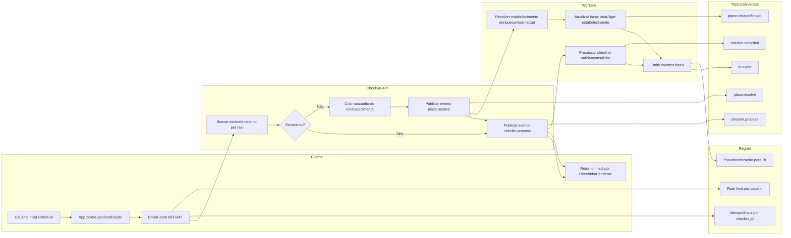

# Fluxos — Cadastro Unificado & Check‑in

> Documento em Markdown com dois fluxos em **Mermaid**: (1) **Cadastro Unificado** (social + dados complementares) e (2) **Check‑in & Cadastro de Estabelecimento** com processamento assíncrono.

---

## 1) Cadastro Unificado — BigTechs + Dados Complementares

```mermaid
flowchart LR
  %% CLIENTE / FRONT
  subgraph Client[Cliente]
    A[Usuário escolhe ''Entrar com Provedor'']
    B[Redireciona para IdP Google, Apple...]
    P[Formulário de dados pessoais e endereço]
    Q[Envio dos dados complementares]
    R[Confirmação e dashboard inicial]
  end

  %% IDENTITY PROVIDER
  subgraph IdP[Provedor de Identidade]
    C[Tela de login/consentimento]
    D[Autorização concedida -> Authorization Code]
  end

  %% AUTH BACKEND
  subgraph Auth[Backend de Autenticação]
    E[Troca Code por Tokens OIDC/OAuth]
    F[Valida id_token iss, aud, exp, nonce]
    G[Upsert Usuário Local]
    H[Emitir JWT/Sessão]
    I[Registrar evento: auth.user_registered/login]
  end

  %% PROFILE API
  subgraph Profile[Profile API]
    J[Validar formato dos dados]
    K[Persistir dados pessoais e endereço]
    L[Emitir evento: profile.updated]
  end

  %% LIGAÇÕES
  A --> B --> C --> D --> E --> F --> G --> H --> I
  H --> P --> Q --> J --> K --> L --> R

  %% ERROS E PROTEÇÕES
  D -. nega/erro .-> X[Exibe erro e opção de tentar novamente]
  B --> Y[PKCE + state/nonce]
  E --> Z[Rate-limit e timeout IdP]

  %% OBSERVABILIDADE
  I --> M[Métricas: auth.success/fail]
  L --> N[Métricas: profile.updated]

  %% DADOS E EVENTOS
  subgraph Data[Eventos/Dados]
    O[auth.user_registered/profile.updated]
  end

  I --> O
  L --> O

  %% DESCRIÇÃO GERAL
  %% Este fluxo une o login via provedores BigTechs e o cadastro de dados complementares.
  %% Após autenticação (Google/Apple), o usuário fornece dados pessoais mínimos e endereço opcional.
  %% Ambos os passos disparam eventos para observabilidade e BI.
```

---

## 2) Check‑in do Usuário & Cadastro de Estabelecimento (assíncrono)

---

### Eventos (resumo)

* `auth.user_registered`, `auth.user_login`
* `profile.updated`
* `place.resolve`, `place.created`, `place.linked`
* `checkin.process`, `checkin.recorded`
* `bi.event`

### Observações

* **LGPD/Privacidade**: pseudonimizar `user_id` para BI; cifrar PII em repouso.
* **Confiabilidade**: Outbox/Idempotência na publicação de eventos; retentativas exponenciais.
* **Métricas**: latência por etapa, taxa de sucesso/falha, % de dedupe de estabelecimento.
