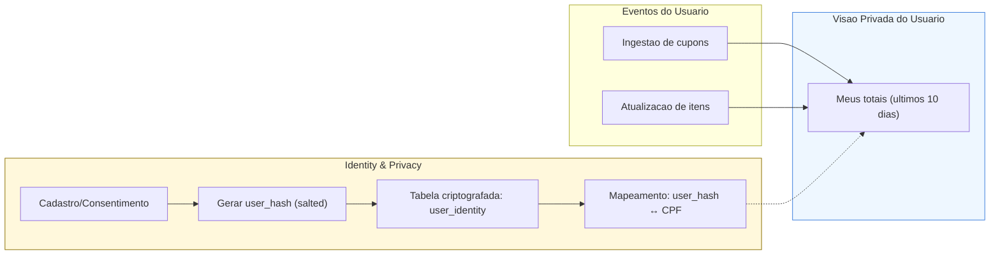

# Fluxo — Domínio Identity & Privacy

> **Objetivo:** manter identidade e consentimentos separados, com vinculação reversível controlada e visão privada ao usuário.

## 🔗 Navegação
- [⬅️ Voltar para README geral dos fluxos](./README.md)
- [📄 Fluxo QR-Code (Receipts)](./fluxo-dominios-qrcode.md)
- [📄 Fluxo Panfleto (Ingestion)](./fluxo-dominios-panfleto.md)
- [📄 Fluxo Pricing](./fluxo-dominios-pricing.md)
- [📄 Fluxo Analytics](./fluxo-dominios-analytics.md)

## 🧩 Diagrama

