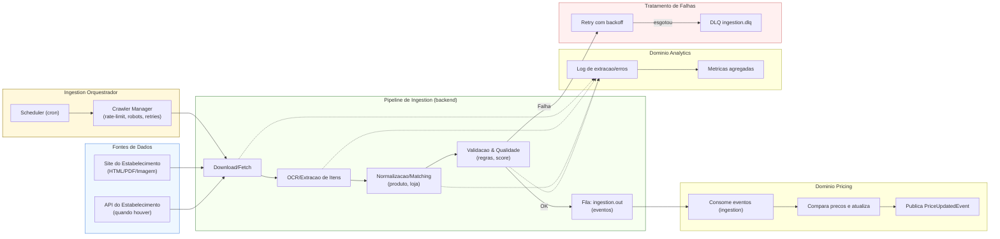

# Fluxo — Domínio Ingestion (Panfletos)

> **Objetivo:** coletar panfletos de estabelecimentos de forma **backend-driven** (sem interação do usuário), extrair itens e publicar eventos.

## 🔗 Navegação
- [⬅️ Voltar para README geral dos fluxos](./README.md)
- [📄 Fluxo QR-Code (Receipts)](./fluxo-dominios-qrcode.md)
- [📄 Fluxo Pricing](./fluxo-dominios-pricing.md)
- [📄 Fluxo Analytics](./fluxo-dominios-analytics.md)
- [📄 Fluxo Identity & Privacy](./fluxo-dominios-identity.md)

## 🧩 Diagrama

