# Fluxo — Domínio Receipts (QR-Code)

> **Objetivo:** ciclo da coleta de cupons via QR-Code (App/Web) até atualização de preços e métricas — visão visual, sem detalhes técnicos.

## 🔗 Navegação
- [⬅️ Voltar para README geral dos fluxos](./README.md)
- [📄 Fluxo Panfleto (Ingestion)](./fluxo-dominios-panfleto.md)
- [📄 Fluxo Pricing](./fluxo-dominios-pricing.md)
- [📄 Fluxo Analytics](./fluxo-dominios-analytics.md)
- [📄 Fluxo Identity & Privacy](./fluxo-dominios-identity.md)

## 🧩 Diagrama

```mermaid
flowchart LR

subgraph U ["Usuario"]
  A1["Joao (App/Web)"]
end

subgraph D1 ["Dominio Receipts"]
  A2["Leitura QR-Code"] --> A3["Envio para Fila Receipts"]
  A3 --> A4["Processamento Receita"]
  A4 --> A5["Recebido e Validado"]
end

subgraph D3 ["Dominio Pricing"]
  C1["Recebe eventos Receipts/Ingestion"]
  C1 --> C2["Compara precos atuais"]
  C2 --> C3["Atualiza banco se diferente"]
  C3 --> C4["Publica PriceUpdatedEvent"]
end

subgraph D4 ["Dominio Search/API"]
  D1["Recebe PriceUpdatedEvent"]
  D1 --> D2["Atualiza Cache/Read Models"]
  D2 --> D3["Disponibiliza nova consulta publica"]
end

subgraph D5 ["Dominio Analytics"]
  E1["Recebe logs de atualizacao"]
  E1 --> E2["Gera metricas agregadas"]
  E2 --> E3["Exportacoes / Paineis publicos"]
end

subgraph D6 ["Dominio Identity & Privacy"]
  F1["Hash anonimo do usuario"]
  F1 --> F2["Tabelas criptografadas: Identidade"]
  F2 --> F3["Mapeamento interno: user_hash ↔ CPF"]
end

A1 -->|QR-Code| A2
A5 -->|Evento CupomProcessado| C1
C4 -->|Novo preco| D1
C4 -->|Log atualizacao| E1
A1 -->|Consulta autenticado| D3
D3 -->|Resumo pessoal| A1
F3 -.-> A1

style F2 fill:#ffe6cc,stroke:#ff6600,stroke-width:2px
style F3 fill:#ffd699,stroke:#ff6600,stroke-width:1px
```

